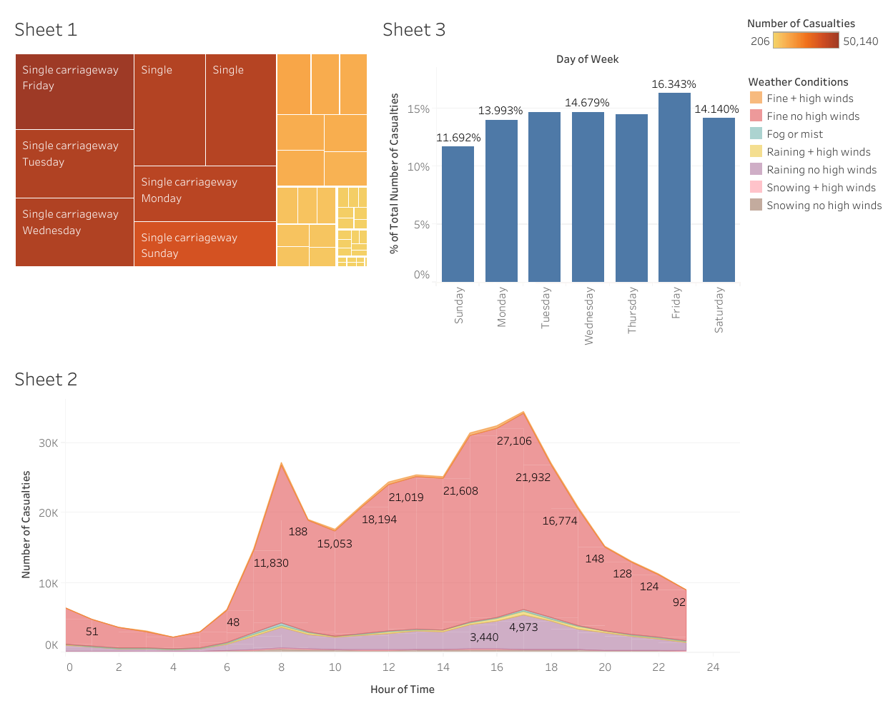

# 🚦 Traffic Accident & Casualties Analysis Dashboard

## 📌 Project Overview
This project presents an **interactive visual analytics dashboard** designed to analyze **road traffic casualties** across multiple dimensions such as **road type, day of week, time of day, and weather conditions**.

The primary objective is to **identify high-risk patterns and temporal trends** in traffic accidents that can support:
- Road safety planning  
- Policy decision-making  
- Preventive and corrective safety measures  

---

## 📊 Dashboard Components & Insights

### 🔹 Sheet 1 – Casualties by Road Type & Day
**Visualization:** Treemap  

**Description:**
- Displays casualty distribution across:
  - Road type (e.g., Single carriageway)
  - Day of the week
- Larger blocks indicate higher casualty counts
- Enables quick identification of risky road infrastructures

**📌 Key Insight**
- **Single carriageways consistently record the highest number of casualties across most days**

---

### 🔹 Sheet 2 – Casualties by Hour of Day & Weather
**Visualization:** Stacked Area Chart  

**Axes:**
- **X-axis:** Hour of day (0–24)
- **Y-axis:** Number of casualties

**Weather Conditions Included:**
- Fine (no high winds)
- Rain
- Fog or mist
- Snow
- High wind conditions

**📌 Key Insights**
- Casualties peak during:
  - **Morning rush hours (7–9 AM)**
  - **Evening rush hours (4–6 PM)**
- Fine weather accounts for most casualties due to higher traffic volume
- Adverse weather increases risk severity but occurs less frequently

---

### 🔹 Sheet 3 – Casualties by Day of Week
**Visualization:** Bar Chart  

**Description:**
- Shows percentage contribution of casualties by weekday
- Helps compare weekday vs weekend accident patterns

**📌 Key Insight**
- **Friday has the highest percentage of casualties**
- **Sunday records comparatively fewer accidents**

---

## 🎯 Key Findings
- Road design plays a significant role in accident severity
- Rush-hour traffic is a major contributor to casualty counts
- Weather conditions amplify risk but are secondary to traffic density
- End-of-week travel behavior increases accident probability

---

## 🛠️ Tools & Technologies
- **Visualization Tool:** Tableau / Business Intelligence Tool  
- **Chart Types Used:**
  - Treemap
  - Stacked Area Chart
  - Bar Chart  
- **Data Domain:** Traffic accidents & casualty analysis

---

## 🧠 Learning Outcomes
- Applied visual analytics techniques to uncover traffic risk patterns
- Used multiple visualization types for temporal and comparative analysis
- Improved analytical storytelling through layout, color encoding, and insights
- Translated raw accident data into actionable road-safety insights
